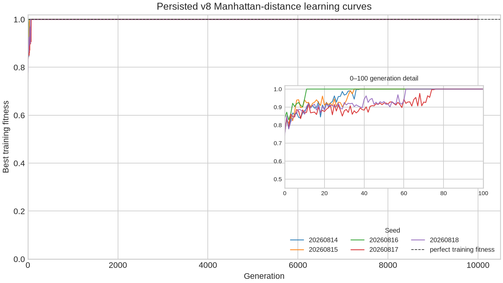

# Evidence-First Evaluation of Bounded Typed Genetic Programming Under Primitive-Contamination Controls

**Status:** Reviewable manuscript draft; **not submitted** and **not peer reviewed**.
**Evidence release:** BEAST v8 foundation revision `e2ea116`.
**Protocol identifier:** `BEAST-V8-PREREG-20260816-A`.

## Abstract

We evaluate a narrow question: whether a population of programs can improve on an objectively scored task without a language model in the evolutionary loop. The system represents candidates as typed abstract syntax trees and executes them only through an interpreter. Before interpreting results, we audit primitive sets for direct task-solving contamination. This audit retracts historical sorting and string-reversal claims because direct primitives were available, and it retains a five-seed clean-sorting negative result. Under the remaining bounded Manhattan-distance evaluator, five declared seeds completed 10,000 generations; each final champion achieved 1.000 correctness on its separately seeded recorded fresh suite of 1,000 cases, and every trial met the predeclared promotion condition. These findings establish evaluator-specific compositional synthesis under the stated configuration. They do not establish general intelligence, general-purpose program synthesis, autonomous production modification, a live distributed evolutionary service, or sorting discovery.

## 1. Introduction

Genetic programming searches over executable program representations by variation and selection [1]. Its scientific value depends on an evaluator that is explicit enough to be inspected and rerun. Reproducible computational research in turn requires recorded inputs, parameters, versions, and workflows [2]. We apply those principles to a small typed-program experiment and treat benchmark contamination as a first-class threat to validity. Contamination is widely recognized as an evaluation risk in other model settings [3]; here, the analogous concern is a primitive that directly implements the target operation.

The contribution is therefore primarily methodological: an executable primitive audit, fail-closed typed-tree checkpoints, fixed-seed trial artifacts, preserved negative outcomes, and a claims registry that prevents a feature implementation from becoming an unmeasured scientific claim.

## 2. Methods

### 2.1 Runtime and execution boundary

Each candidate is a typed AST built from a declared primitive profile and interpreted by the GP runtime. The experiment records the following boundary for every trial:

- zero language-model calls in evaluation, selection, mutation, scoring, curriculum promotion, and import verification;
- zero network calls in the evolutionary loop;
- no execution of generated source; source export is for audit only; and
- a fresh, separately seeded evaluator suite used for promotion evidence.

The v8 checkpoint schema stores recursive trees, primitive-profile names, full fitness results, and RNG state. Unknown primitives fail closed. Host-dependent timing telemetry is deliberately excluded from deterministic-result comparison; tree structure and scientific evidence fields are retained.

### 2.2 Contamination audit

The audit enumerates one-operation trees and evaluates their direct task fit under each primitive profile. Direct-task primitives lead to retraction rather than post-hoc qualification. The resulting classifications include:

| Task | Classification | Consequence |
|---|---|---|
| Historical sorting | `RETRACTED_DIRECT_PRIMITIVE` (`sort1`) | Not evidence of sorting discovery |
| String reverse | `RETRACTED_DIRECT_PRIMITIVE` (`reverse1`) | Not evidence of reversal discovery |
| Game strategy | `INVALID_EVALUATOR_CONTRACT` | Not promoted as a benchmark claim |
| Clean sorting v1 | No direct match observed | Eligible for a new experiment, but observed result remains negative |
| Manhattan distance | No one-operation match observed | Eligible under the declared evaluator and profile |

### 2.3 Pre-registered trials

The Manhattan protocol declared five seeds—20260814 through 20260818—each with population size 128, maximum depth 7, mutation rate 0.22, crossover rate 0.85, elitism count 4, and a 10,000-generation ceiling. Promotion required completion at the declared horizon, fresh correctness of at least 0.95, and a final tree absent from the initial population. Final fresh suites contained 1,000 evaluator-owned cases.

The comparison clean-sorting profile used no direct `sort1`, `map_sq`, `filter_pos`, `unique`, `reverse1`, or `sum1` primitive. Its five 10,000-generation trials are reported whether or not they meet promotion criteria.

## 3. Results

### 3.1 Manhattan-distance result

All five declared Manhattan trials completed and met the predeclared eligibility rule. The first generation with perfect training fitness differed by seed, and each final champion recorded 1.000 fresh correctness on 1,000 cases.

| Seed | First perfect training generation | Fresh correctness | Fresh cases | Promotion eligible |
|---:|---:|---:|---:|---|
| 20260814 | 38 | 1.000 | 1,000 | Yes |
| 20260815 | 35 | 1.000 | 1,000 | Yes |
| 20260816 | 11 | 1.000 | 1,000 | Yes |
| 20260817 | 76 | 1.000 | 1,000 | Yes |
| 20260818 | 61 | 1.000 | 1,000 | Yes |

**Figure 1.** The five curves below are generated directly from the persisted per-generation trial histories; the inset preserves early-generation detail while the main panel retains the complete 10,000-generation record.



The valid conclusion is narrow: on this evaluator, with this primitive profile and configuration, the final programs were not present in their own generation-zero populations and achieved the recorded fresh-evaluator scores. This does not prove cross-seed structural uniqueness, because that comparison has not been separately established.

### 3.2 Clean-sorting negative result

The clean-sorting profile completed all five declared trials and produced **0/5 eligible successes**. Fresh correctness was approximately 0.50 (range 0.495–0.513). This is a retained negative outcome, not a discarded preliminary. It supports neither a claim that sorting was evolved nor a numerical prediction for a later curriculum campaign.

## 4. Reproducibility appendix

### 4.1 Frozen artifacts

| Artifact | Role |
|---|---|
| `docs/v8-experiment-preregistration.md` | Seed list, protocol, and eligibility rule |
| `reports/v8/manhattan-distance/seed_*/trial.json` | Per-generation history, final tree, fresh suite, and boundary record |
| `reports/v8/manhattan-distance/summary.json` | Aggregate five-seed result |
| `reports/v8/clean-sorting/summary.json` | Retained five-seed negative result |
| `docs/v8-contamination-audit.json` | Task-level contamination classification |
| `docs/v8-benchmark-ledger.json` | Contamination-adjusted benchmark ledger |
| `scripts/run_v8_multiseed.py` | Executable declared-trial runner |
| `scripts/build_v9_paper_figure.py` | Non-executing figure generator from persisted histories |

### 4.2 Commands

```bash
# Historical v8 evidence checkout and core fidelity/experiment contracts.
git checkout e2ea116
APP_ENV=dev JWT_SECRET='v7-local-test-secret' pytest -q \
  evolution/test_checkpoint_fidelity.py evolution/test_clean_sorting.py \
  evolution/test_proof_benchmark.py

# Full five-seed re-execution; allocate compute before starting.
APP_ENV=dev JWT_SECRET='v7-local-test-secret' \
  python scripts/run_v8_multiseed.py manhattan-distance --output-dir /tmp/v8-reproduction

# From the v9 release tree, derive Figure 1 from committed evidence only.
python scripts/build_v9_paper_figure.py
```

## 5. Limitations and future work

The sample contains one positive bounded task and one clean-sorting negative result. It does not assess arbitrary source-code tasks, external tools, business workflows, or performance across unseen problem families. No cross-seed structural-diversity claim is made. The five-stage clean curriculum is implemented and tested but has not yet been run as the planned five-seed 100,000-generation study. The local signed discovery exchange is not network transport or a deployed federation. The observatory is local/preview verified, not evidence of a public always-on service.

Future work is gated by a published long-run preregistration, declared compute hardware, durable checkpoint storage, all-seed artifact retention, independent reruns, author approval for any external submission, and an explicit deployment authorization. Those gates are documented in `docs/v9-advanced-research-roadmap.md` and `docs/v9-submission-and-deployment-gates.md`.

## References

[1] J. R. Koza. *Genetic Programming: On the Programming of Computers by Means of Natural Selection*. MIT Press, 1992. [Publisher record](https://mitpress.mit.edu/9780262111706/genetic-programming/).

[2] G. K. Sandve, A. Nekrutenko, J. Taylor, and E. Hovig. “Ten Simple Rules for Reproducible Computational Research.” *PLoS Computational Biology*, 9(10):e1003285, 2013. [Open-access article](https://pmc.ncbi.nlm.nih.gov/articles/PMC3812051/).

[3] C. Xu, S. Guan, D. Greene, and M.-T. Kechadi. “Benchmark Data Contamination of Large Language Models: A Survey.” arXiv:2406.04244, 2024. [Record](https://arxiv.org/abs/2406.04244).
